# 그룹 챌린지 어플리케이션 Wireframe

본 문서는 그룹 챌린지 어플리케이션의 주요 화면 구조를 wireframe 형식으로 표현한 것입니다.

## 목차

1. [인증 및 온보딩](#1-인증-및-온보딩)
2. [메인 네비게이션](#2-메인-네비게이션)
3. [그룹 관련 화면](#3-그룹-관련-화면)
4. [커뮤니티 화면](#4-커뮤니티-화면)
5. [개인 기록 화면](#5-개인-기록-화면)
6. [프로필 및 설정](#6-프로필-및-설정)
7. [기타 기능](#7-기타-기능)

---

## 1. 인증 및 온보딩

### 1.1 로그인/회원가입 화면

#### 텍스트 Wireframe

```
┌─────────────────────────────────┐
│         [로고/앱 이름]           │
│                                 │
│      그룹과 함께하는            │
│      루틴 챌린지                │
│                                 │
│  ┌─────────────────────────┐   │
│  │  카카오로 시작하기       │   │
│  └─────────────────────────┘   │
│                                 │
│  ┌─────────────────────────┐   │
│  │  구글로 시작하기        │   │
│  └─────────────────────────┘   │
│                                 │
│  ┌─────────────────────────┐   │
│  │  네이버로 시작하기       │   │
│  └─────────────────────────┘   │
│                                 │
│  ──────────── 또는 ───────────  │
│                                 │
│  ┌─────────────────────────┐   │
│  │  이메일로 시작하기       │   │
│  └─────────────────────────┘   │
│                                 │
│    이미 계정이 있으신가요?      │
│         [로그인하기]            │
│                                 │
│    [이용약관] [개인정보처리방침]│
└─────────────────────────────────┘
```

#### Mermaid 다이어그램

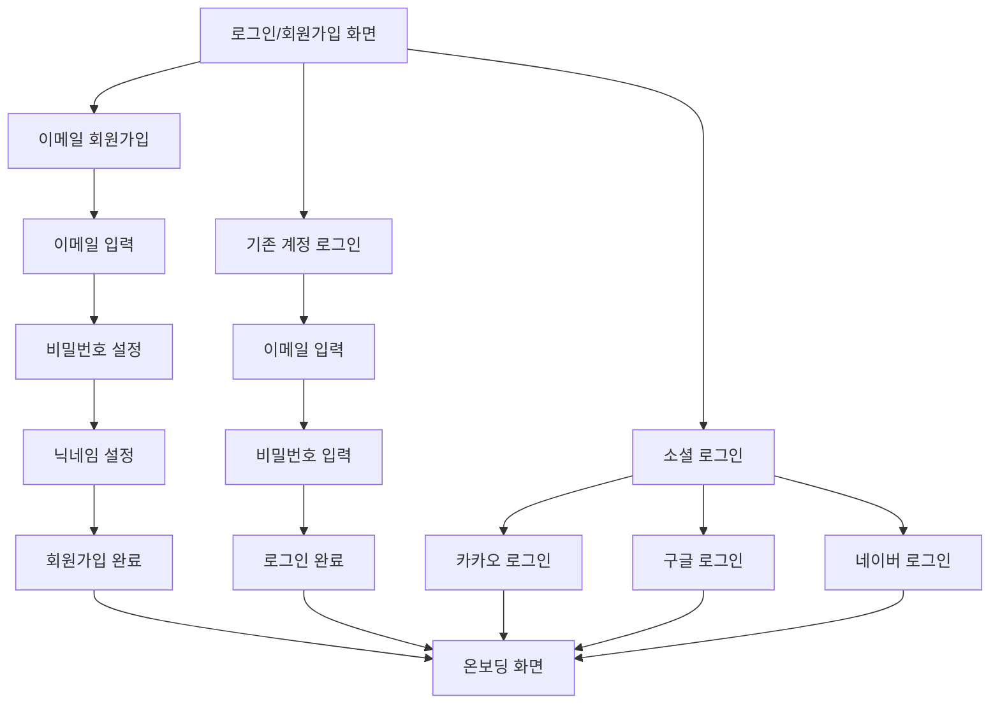

#### 화면 설명

- **로고/앱 이름**: 서비스 브랜딩 영역
- **소셜 로그인 버튼**: 카카오, 구글, 네이버 소셜 로그인 제공
- **이메일 회원가입**: 이메일과 비밀번호 기반 회원가입
- **로그인 링크**: 기존 계정 로그인 화면으로 이동
- **약관 링크**: 이용약관 및 개인정보처리방침 확인

---

### 1.2 온보딩 튜토리얼 화면

#### 텍스트 Wireframe

```
┌─────────────────────────────────┐
│              [X]                │
│                                 │
│         [이미지/일러스트]        │
│                                 │
│                                 │
│      함께하는 루틴 챌린지       │
│                                 │
│   그룹과 함께 목표를 달성하고   │
│   일상적인 성취를 공유하며      │
│   지지 네트워크를 형성하세요    │
│                                 │
│                                 │
│    ● ─ ─  (1/3)                │
│                                 │
│    [다음]                       │
│                                 │
└─────────────────────────────────┘
```

#### Mermaid 다이어그램

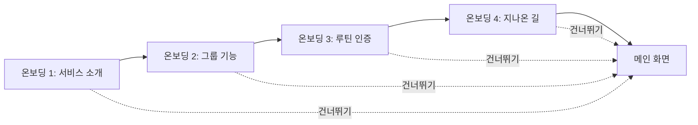

#### 화면 설명

- **페이지 인디케이터**: 현재 온보딩 페이지 위치 표시 (● ─ ─)
- **주요 내용**: 각 페이지별 핵심 기능 소개
- **다음 버튼**: 다음 온보딩 페이지로 이동
- **건너뛰기**: 온보딩을 건너뛰고 메인 화면으로 이동

---

## 2. 메인 네비게이션

### 2.1 하단 탭 네비게이션 구조

#### 텍스트 Wireframe

```
┌─────────────────────────────────┐
│                                 │
│      [메인 콘텐츠 영역]         │
│                                 │
│                                 │
│                                 │
│                                 │
│                                 │
│                                 │
│                                 │
│                                 │
│                                 │
│                                 │
│                                 │
│                                 │
│                                 │
│                                 │
│                                 │
│                                 │
│                                 │
│                                 │
│                                 │
│                                 │
│ ─────────────────────────────── │
│  [그룹] [취미] [여정] [프로필]  │
│   탐색   공유방  지나온길        │
└─────────────────────────────────┘
```

#### Mermaid 다이어그램

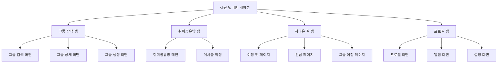

#### 화면 설명

- **하단 고정 탭**: 4개의 주요 섹션으로 구성
  - 그룹 탐색: 그룹 검색 및 참여
  - 취미공유방: 커뮤니티 공간
  - 지나온 길: 개인 여정 기록
  - 프로필: 사용자 정보 및 설정
- **탭 활성화 표시**: 현재 선택된 탭 강조 표시
- **배지 표시**: 알림이 있는 경우 탭에 배지 표시 가능

---

## 3. 그룹 관련 화면

### 3.1 그룹 검색/탐색 화면

#### 텍스트 Wireframe

```
┌─────────────────────────────────┐
│  [검색 아이콘]  그룹 검색...    │
│                                 │
│  [필터] [정렬]  [+ 그룹 만들기] │
│                                 │
│  ────────────────────────────  │
│                                 │
│  ┌──────────┐  ┌──────────┐   │
│  │ [이미지] │  │ [이미지] │   │
│  │ 그룹명   │  │ 그룹명   │   │
│  │ 주제     │  │ 주제     │   │
│  │ 기간     │  │ 기간     │   │
│  │ 인원수   │  │ 인원수   │   │
│  └──────────┘  └──────────┘   │
│                                 │
│  ┌──────────┐  ┌──────────┐   │
│  │ [이미지] │  │ [이미지] │   │
│  │ 그룹명   │  │ 그룹명   │   │
│  │ 주제     │  │ 주제     │   │
│  │ 기간     │  │ 기간     │   │
│  │ 인원수   │  │ 인원수   │   │
│  └──────────┘  └──────────┘   │
│                                 │
│  [추천 그룹 섹션]               │
│  ┌──────────┐  ┌──────────┐   │
│  │ [이미지] │  │ [이미지] │   │
│  │ 추천     │  │ 추천     │   │
│  └──────────┘  └──────────┘   │
│                                 │
└─────────────────────────────────┘
```

#### Mermaid 다이어그램

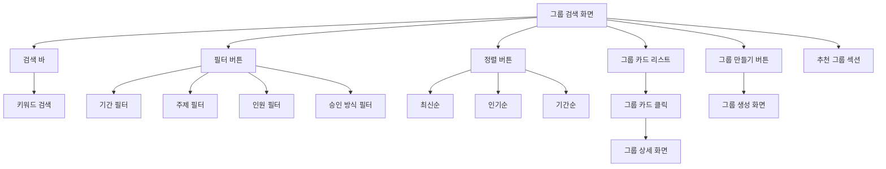

#### 화면 설명

- **검색 바**: 그룹명, 주제, 설명으로 검색
- **필터 버튼**: 기간, 주제, 인원, 승인 방식 필터링
- **정렬 버튼**: 최신순, 인기순, 기간순 정렬
- **그룹 만들기**: 새 그룹 생성 화면으로 이동
- **그룹 카드**: 그리드 레이아웃으로 그룹 목록 표시
  - 그룹 이미지/썸네일
  - 그룹명
  - 주제/설명
  - 기간 정보
  - 현재 인원/최대 인원
- **추천 그룹**: 개인화 추천 그룹 표시

---

### 3.2 그룹 상세 정보 화면

#### 텍스트 Wireframe

```
┌─────────────────────────────────┐
│  [←]              [⋮ 메뉴]     │
│                                 │
│  ┌─────────────────────────┐   │
│  │    [그룹 이미지]        │   │
│  └─────────────────────────┘   │
│                                 │
│      그룹명: 운동 챌린지        │
│      주제: 매일 운동하기        │
│                                 │
│  📅 기간: 2024.01.01 ~ 03.31   │
│  👥 인원: 5/10명               │
│  ✅ 승인: 자동 승인            │
│                                 │
│  ────────────────────────────  │
│                                 │
│  그룹 설명:                    │
│  매일 30분 이상 운동하고        │
│  인증하는 그룹입니다.           │
│                                 │
│  ────────────────────────────  │
│                                 │
│  그룹장: [프로필] 닉네임        │
│                                 │
│  멤버 (5명)                    │
│  [프로필] [프로필] [프로필] ... │
│                                 │
│  ────────────────────────────  │
│                                 │
│  ┌─────────────────────────┐   │
│  │   [그룹 참여하기]        │   │
│  └─────────────────────────┘   │
│                                 │
└─────────────────────────────────┘
```

#### Mermaid 다이어그램

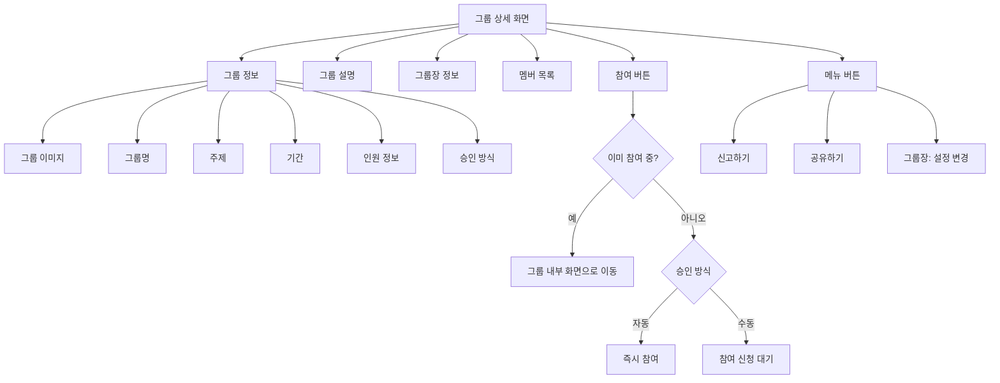

#### 화면 설명

- **그룹 이미지**: 그룹 대표 이미지
- **그룹 정보**: 그룹명, 주제, 기간, 인원, 승인 방식
- **그룹 설명**: 그룹에 대한 상세 설명
- **그룹장 정보**: 그룹장 프로필 표시
- **멤버 목록**: 현재 참여 중인 멤버들의 프로필 미리보기
- **참여 버튼**: 
  - 미참여: "그룹 참여하기" 버튼
  - 참여 중: "그룹 보기" 버튼으로 변경
  - 대기 중: "참여 대기 중" 표시
- **메뉴**: 신고, 공유, 그룹장의 경우 설정 변경

---

### 3.3 그룹 생성 화면

#### 텍스트 Wireframe

```
┌─────────────────────────────────┐
│  [←]         그룹 만들기        │
│                                 │
│  ────────────────────────────  │
│                                 │
│  그룹 이미지                     │
│  ┌─────────────────────────┐   │
│  │    [+ 이미지 추가]      │   │
│  └─────────────────────────┘   │
│                                 │
│  그룹명 *                        │
│  ┌─────────────────────────┐   │
│  │  그룹명을 입력하세요    │   │
│  └─────────────────────────┘   │
│                                 │
│  주제/설명 *                     │
│  ┌─────────────────────────┐   │
│  │  그룹 주제와 설명을      │   │
│  │  입력하세요              │   │
│  │                         │   │
│  └─────────────────────────┘   │
│                                 │
│  그룹 기간 *                     │
│  ┌─────────────────────────┐   │
│  │  3주 ▼                  │   │
│  └─────────────────────────┘   │
│    (3주, 1개월, 2개월, 3개월)   │
│                                 │
│  최대 인원수 *                   │
│  ┌─────────────────────────┐   │
│  │  10명 ▼                 │   │
│  └─────────────────────────┘   │
│                                 │
│  참여 승인 방식 *                │
│  ○ 자동 승인                    │
│  ● 수동 승인                    │
│                                 │
│  ────────────────────────────  │
│                                 │
│  ┌─────────────────────────┐   │
│  │   [그룹 만들기]          │   │
│  └─────────────────────────┘   │
│                                 │
└─────────────────────────────────┘
```

#### Mermaid 다이어그램

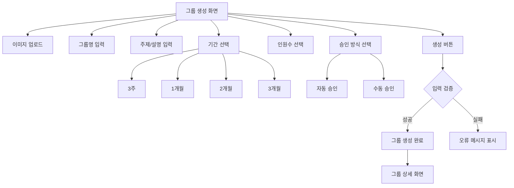

#### 화면 설명

- **이미지 업로드**: 그룹 대표 이미지 선택 (선택사항)
- **그룹명**: 필수 입력 항목
- **주제/설명**: 그룹에 대한 설명 입력
- **그룹 기간**: 드롭다운으로 3주, 1개월, 2개월, 3개월 선택
- **최대 인원수**: 숫자 입력 또는 드롭다운 선택
- **승인 방식**: 라디오 버튼으로 자동/수동 선택
- **생성 버튼**: 모든 필수 항목 입력 후 그룹 생성

---

### 3.4 그룹 내 인증 게시물 화면 (패들렛 형식)

#### 텍스트 Wireframe

```
┌─────────────────────────────────┐
│  [←]  그룹명        [⋮ 메뉴]   │
│                                 │
│  ────────────────────────────  │
│                                 │
│  그룹 정보                       │
│  기간: 01.01 ~ 03.31 (D-45)     │
│  인원: 5/10명                   │
│                                 │
│  ────────────────────────────  │
│                                 │
│  [최신순 ▼]  [+ 인증하기]       │
│                                 │
│  ┌──────┐  ┌──────┐  ┌──────┐ │
│  │[사진]│  │[사진]│  │[사진]│ │
│  │닉네임│  │닉네임│  │닉네임│ │
│  │시간  │  │시간  │  │시간  │ │
│  │💬 3  │  │💬 1  │  │💬 0  │ │
│  └──────┘  └──────┘  └──────┘ │
│                                 │
│  ┌──────┐  ┌──────┐  ┌──────┐ │
│  │[사진]│  │[사진]│  │[사진]│ │
│  │닉네임│  │닉네임│  │닉네임│ │
│  │시간  │  │시간  │  │시간  │ │
│  │💬 5  │  │💬 2  │  │💬 1  │ │
│  └──────┘  └──────┘  └──────┘ │
│                                 │
│  ┌──────┐  ┌──────┐           │
│  │[사진]│  │[사진]│           │
│  │닉네임│  │닉네임│           │
│  │시간  │  │시간  │           │
│  │💬 0  │  │💬 4  │           │
│  └──────┘  └──────┘           │
│                                 │
│  [더 보기...]                   │
│                                 │
└─────────────────────────────────┘
```

#### Mermaid 다이어그램

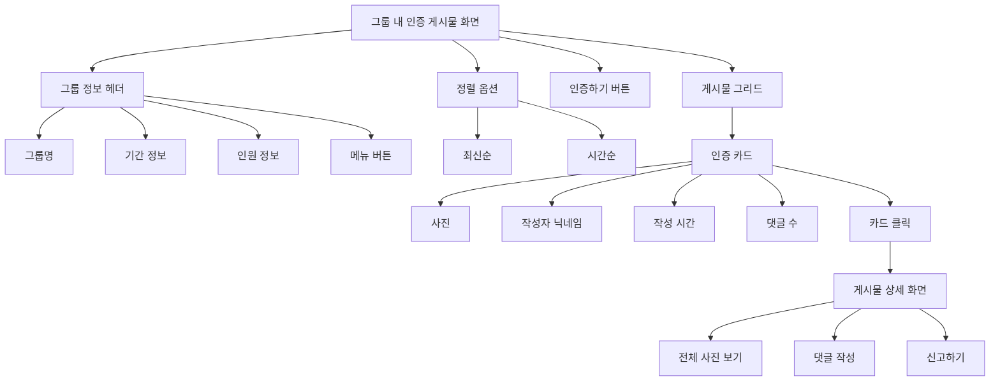

#### 화면 설명

- **그룹 정보 헤더**: 그룹명, 기간, 인원 정보 표시
- **정렬 옵션**: 최신순/시간순 정렬 선택
- **인증하기 버튼**: 새 루틴 인증 작성
- **게시물 그리드**: 패들렛 형식의 카드 그리드 레이아웃
  - 각 카드: 사진, 작성자 닉네임, 작성 시간, 댓글 수
  - 카드 클릭 시 상세 보기
- **무한 스크롤**: 스크롤 시 추가 게시물 로드

---

### 3.5 루틴 인증 작성 화면

#### 텍스트 Wireframe

```
┌─────────────────────────────────┐
│  [←]         인증하기           │
│                                 │
│  ────────────────────────────  │
│                                 │
│  오늘의 루틴 인증               │
│                                 │
│  사진 추가 *                     │
│  ┌─────────────────────────┐   │
│  │                         │   │
│  │    [+ 사진 추가]        │   │
│  │    (최대 1장)           │   │
│  │                         │   │
│  └─────────────────────────┘   │
│                                 │
│  인증 내용 (선택)                │
│  ┌─────────────────────────┐   │
│  │  오늘의 루틴 인증 내용을 │   │
│  │  작성해주세요            │   │
│  │                         │   │
│  │                         │   │
│  └─────────────────────────┘   │
│                                 │
│  ────────────────────────────  │
│                                 │
│  그룹: 운동 챌린지              │
│  날짜: 2024.01.15              │
│                                 │
│  ────────────────────────────  │
│                                 │
│  ⚠️ 주의사항                    │
│  - 그룹 주제와 관련된           │
│    인증만 업로드해주세요         │
│  - 부적절한 사진은 신고될       │
│    수 있습니다                  │
│                                 │
│  ────────────────────────────  │
│                                 │
│  ┌─────────────────────────┐   │
│  │   [인증 올리기]          │   │
│  └─────────────────────────┘   │
│                                 │
└─────────────────────────────────┘
```

#### Mermaid 다이어그램

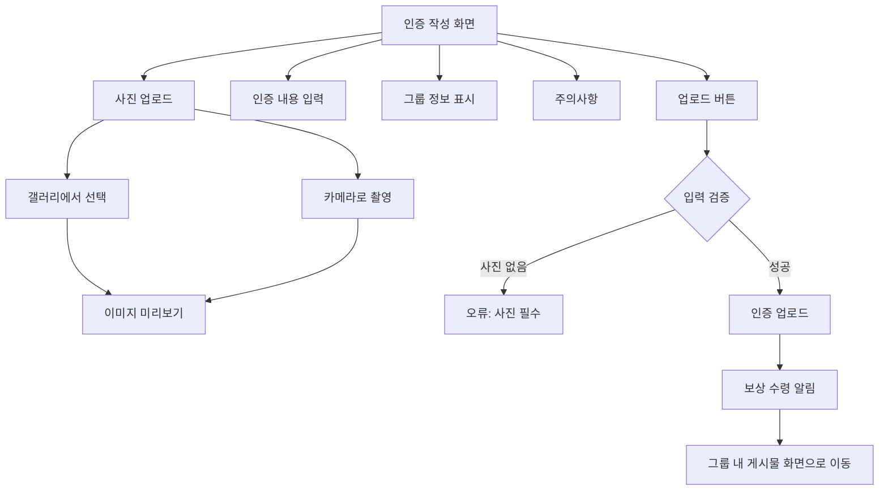

#### 화면 설명

- **사진 추가**: 필수 항목, 갤러리 또는 카메라로 추가
- **인증 내용**: 선택 사항, 텍스트 입력
- **그룹 정보**: 현재 인증할 그룹 정보 표시
- **날짜**: 인증 날짜 자동 표시
- **주의사항**: 그룹 주제 준수 및 신고 안내
- **업로드 버튼**: 인증 게시물 업로드 및 보상 수령

---

## 4. 커뮤니티 화면

### 4.1 취미공유방 메인 화면

#### 텍스트 Wireframe

```
┌─────────────────────────────────┐
│  취미공유방      [✏️ 작성]      │
│                                 │
│  ────────────────────────────  │
│                                 │
│  ┌─────────────────────────┐   │
│  │ [프로필] 닉네임          │   │
│  │                         │   │
│  │ 쿠키런 같이 하실분!      │   │
│  │ ID = 블라블라           │   │
│  │                         │   │
│  │ 💬 5  👍 12  📅 2시간 전│   │
│  └─────────────────────────┘   │
│                                 │
│  ┌─────────────────────────┐   │
│  │ [프로필] 닉네임          │   │
│  │                         │   │
│  │ 우울할 때 듣는 노래      │   │
│  │ 추천드려요               │   │
│  │                         │   │
│  │ 💬 8  👍 25  📅 5시간 전│   │
│  └─────────────────────────┘   │
│                                 │
│  ┌─────────────────────────┐   │
│  │ [프로필] 닉네임          │   │
│  │                         │   │
│  │ [이미지]                 │   │
│  │                         │   │
│  │ 오늘 만든 작품 공유해요  │   │
│  │                         │   │
│  │ 💬 3  👍 15  📅 1일 전  │   │
│  └─────────────────────────┘   │
│                                 │
│  [더 보기...]                   │
│                                 │
└─────────────────────────────────┘
```

#### Mermaid 다이어그램

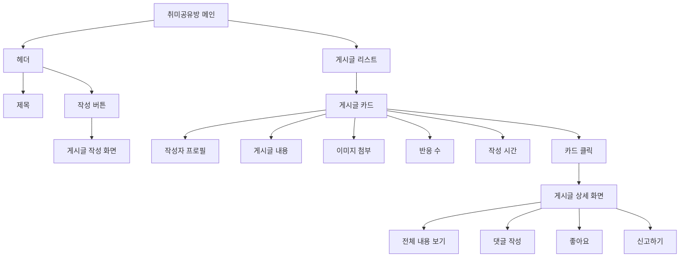

#### 화면 설명

- **헤더**: "취미공유방" 제목과 작성 버튼
- **게시글 리스트**: 최신순으로 게시글 표시
- **게시글 카드**: 
  - 작성자 프로필
  - 게시글 내용 (텍스트 및 이미지)
  - 댓글 수, 좋아요 수, 작성 시간
- **작성 버튼**: 새 게시글 작성 (하루 1개 제한)
- **무한 스크롤**: 스크롤 시 추가 게시글 로드

---

### 4.2 취미공유방 게시글 작성 화면

#### 텍스트 Wireframe

```
┌─────────────────────────────────┐
│  [←]      게시글 작성           │
│                                 │
│  ────────────────────────────  │
│                                 │
│  ┌─────────────────────────┐   │
│  │ [프로필] 닉네임          │   │
│  └─────────────────────────┘   │
│                                 │
│  ┌─────────────────────────┐   │
│  │  취미나 함께할 사람을    │   │
│  │  공유해주세요            │   │
│  │                         │   │
│  │                         │   │
│  └─────────────────────────┘   │
│                                 │
│  [+ 이미지 추가] (선택)          │
│  ┌──────┐  ┌──────┐           │
│  │[이미지]│ │[이미지]│ [+ 추가]│
│  └──────┘  └──────┘           │
│                                 │
│  ────────────────────────────  │
│                                 │
│  ⚠️ 하루에 1개의 게시글만       │
│     작성할 수 있습니다           │
│                                 │
│  남은 작성 가능 횟수: 1/1       │
│                                 │
│  ────────────────────────────  │
│                                 │
│  ┌─────────────────────────┐   │
│  │   [게시글 올리기]        │   │
│  └─────────────────────────┘   │
│                                 │
└─────────────────────────────────┘
```

#### Mermaid 다이어그램

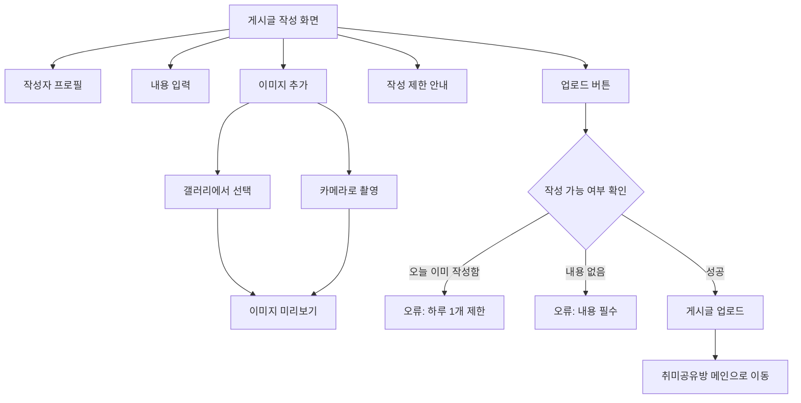

#### 화면 설명

- **작성자 프로필**: 현재 사용자 프로필 표시
- **내용 입력**: 게시글 텍스트 입력 (필수)
- **이미지 추가**: 선택 사항, 여러 장 추가 가능
- **작성 제한 안내**: 하루 1개 제한 안내 및 남은 횟수 표시
- **업로드 버튼**: 게시글 업로드

---

## 5. 개인 기록 화면

### 5.1 지나온 길 첫 페이지 ("00님의 여정")

#### 텍스트 Wireframe

```
┌─────────────────────────────────┐
│  지나온 길                      │
│                                 │
│  ────────────────────────────  │
│                                 │
│         [프로필 이미지]         │
│                                 │
│      홍길동님의 여정            │
│                                 │
│  함께 걸어온 길을                │
│  되돌아보세요                   │
│                                 │
│  ────────────────────────────  │
│                                 │
│  통계                            │
│  ┌──────────┐  ┌──────────┐   │
│  │ 참여 그룹│  │ All Clear │   │
│  │   12    │  │    5      │   │
│  └──────────┘  └──────────┘   │
│                                 │
│  ┌──────────┐  ┌──────────┐   │
│  │ 총 인증  │  │ 현재 참여 │   │
│  │   245   │  │    3     │   │
│  └──────────┘  └──────────┘   │
│                                 │
│  ────────────────────────────  │
│                                 │
│  ┌─────────────────────────┐   │
│  │   [여정 시작하기]        │   │
│  └─────────────────────────┘   │
│                                 │
└─────────────────────────────────┘
```

#### Mermaid 다이어그램

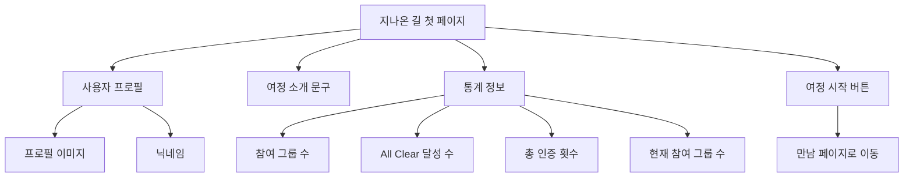

#### 화면 설명

- **프로필 영역**: 사용자 프로필 이미지와 닉네임
- **여정 소개**: 개인화된 여정 소개 문구
- **통계 정보**: 4개의 주요 통계 카드
  - 참여 그룹 수
  - All Clear 달성 수
  - 총 인증 횟수
  - 현재 참여 중인 그룹 수
- **여정 시작 버튼**: 만남 페이지로 이동

---

### 5.2 지나온 길 만남 페이지 ("00님과 0번째 만남")

#### 텍스트 Wireframe

```
┌─────────────────────────────────┐
│  [←]  지나온 길                 │
│                                 │
│  ────────────────────────────  │
│                                 │
│  ┌─────────────────────────┐   │
│  │ [프로필]                │   │
│  │                         │   │
│  │ 홍길동님과 1번째 만남    │   │
│  │                         │   │
│  │ 함께한 그룹: 운동 챌린지 │   │
│  │ 기간: 2024.01.01~03.31  │   │
│  │                         │   │
│  │ 💬 댓글을 주고받았어요   │   │
│  └─────────────────────────┘   │
│                                 │
│  ┌─────────────────────────┐   │
│  │ [프로필]                │   │
│  │                         │   │
│  │ 홍길동님과 2번째 만남    │   │
│  │                         │   │
│  │ 함께한 그룹: 독서 챌린지 │   │
│  │ 기간: 2024.02.01~02.28  │   │
│  │                         │   │
│  │ 👥 같은 그룹에서 활동    │   │
│  └─────────────────────────┘   │
│                                 │
│  ┌─────────────────────────┐   │
│  │ [프로필]                │   │
│  │                         │   │
│  │ 홍길동님과 3번째 만남    │   │
│  │                         │   │
│  │ 함께한 그룹: 공부 챌린지 │   │
│  │ 기간: 2024.03.01~03.31  │   │
│  │                         │   │
│  │ 💬 댓글을 주고받았어요   │   │
│  └─────────────────────────┘   │
│                                 │
│  [더 보기...]                   │
│                                 │
└─────────────────────────────────┘
```

#### Mermaid 다이어그램

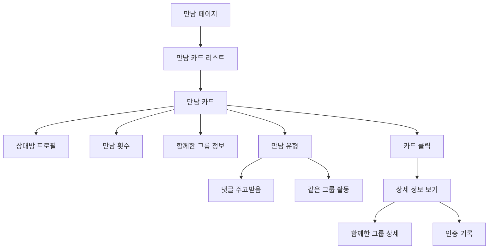

#### 화면 설명

- **만남 카드**: 과거에 만났던 사람들의 기록
  - 상대방 프로필 이미지
  - "00님과 N번째 만남" 형식
  - 함께한 그룹 정보 (그룹명, 기간)
  - 만남 유형 표시 (댓글 주고받음, 같은 그룹 활동)
- **정렬**: 만남 횟수 순 또는 최신순
- **카드 클릭**: 함께한 그룹 상세 정보 확인

---

### 5.3 지나온 길 그룹 참여 여정 페이지

#### 텍스트 Wireframe

```
┌─────────────────────────────────┐
│  [←]  지나온 길                 │
│                                 │
│  ────────────────────────────  │
│                                 │
│  ┌─────────────────────────┐   │
│  │ ⭐ [골드 테두리]         │   │
│  │                         │   │
│  │ 운동 챌린지              │   │
│  │                         │   │
│  │ 2024.01.01 ~ 03.31      │   │
│  │                         │   │
│  │ ✅ All Clear (100%)     │   │
│  │                         │   │
│  │ 🏆 특별 배지 획득        │   │
│  └─────────────────────────┘   │
│                                 │
│  ┌─────────────────────────┐   │
│  │                         │   │
│  │ 독서 챌린지              │   │
│  │                         │   │
│  │ 2024.02.01 ~ 02.28      │   │
│  │                         │   │
│  │ 참여도: 75%             │   │
│  │                         │   │
│  └─────────────────────────┘   │
│                                 │
│  ┌─────────────────────────┐   │
│  │ [어두운 회색 톤]         │   │
│  │                         │   │
│  │ 공부 챌린지              │   │
│  │                         │   │
│  │ 2024.03.01 ~ 03.31      │   │
│  │                         │   │
│  │ 참여도: 15%             │   │
│  │                         │   │
│  └─────────────────────────┘   │
│                                 │
│  [더 보기...]                   │
│                                 │
└─────────────────────────────────┘
```

#### Mermaid 다이어그램

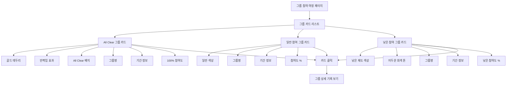

#### 화면 설명

- **All Clear 그룹 카드** (100% 참여도):
  - 골드 테두리 및 반짝임 효과
  - "All Clear" 배지 표시
  - 특별 배지 획득 표시
  - 가장 눈에 띄게 표시
  
- **일반 참여 그룹 카드** (20% 이상):
  - 일반 색상으로 표시
  - 참여도 퍼센트 표시
  
- **낮은 참여 그룹 카드** (20% 미만):
  - 낮은 채도 색상 (어두운 회색 톤)
  - 참여도가 낮음을 시각적으로 표현
  
- **카드 정보**: 그룹명, 기간, 참여도
- **카드 클릭**: 해당 그룹의 상세 기록 확인

---

## 6. 프로필 및 설정

### 6.1 사용자 프로필 화면

#### 텍스트 Wireframe

```
┌─────────────────────────────────┐
│  [←]              [⚙️ 설정]    │
│                                 │
│  ────────────────────────────  │
│                                 │
│      [프로필 이미지]            │
│                                 │
│         닉네임                  │
│      Lv. 15                     │
│                                 │
│  ────────────────────────────  │
│                                 │
│  자기소개                        │
│  안녕하세요! 루틴 챌린지        │
│  함께해요~                      │
│                                 │
│  ────────────────────────────  │
│                                 │
│  활동 통계                       │
│  ┌──────────┐  ┌──────────┐   │
│  │ 참여 그룹│  │ All Clear │   │
│  │   12    │  │    5      │   │
│  └──────────┘  └──────────┘   │
│                                 │
│  ┌──────────┐  ┌──────────┐   │
│  │ 총 인증  │  │ 현재 참여 │   │
│  │   245   │  │    3     │   │
│  └──────────┘  └──────────┘   │
│                                 │
│  ────────────────────────────  │
│                                 │
│  보유 포인트: 1,250 P           │
│                                 │
│  ────────────────────────────  │
│                                 │
│  배지 컬렉션                     │
│  ┌──┐ ┌──┐ ┌──┐ ┌──┐ ┌──┐    │
│  │🏆│ │⭐│ │🔥│ │💪│ │📚│    │
│  └──┘ └──┘ └──┘ └──┘ └──┘    │
│  [더 보기...]                   │
│                                 │
│  ────────────────────────────  │
│                                 │
│  ┌─────────────────────────┐   │
│  │   [프로필 수정]          │   │
│  └─────────────────────────┘   │
│                                 │
└─────────────────────────────────┘
```

#### Mermaid 다이어그램

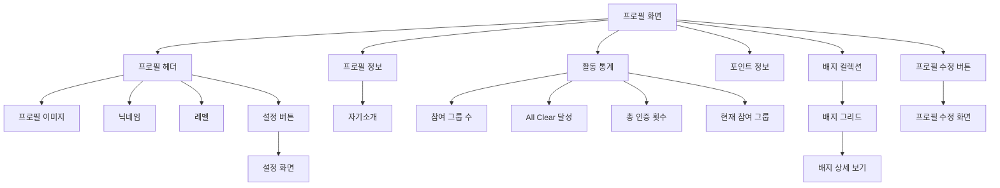

#### 화면 설명

- **프로필 헤더**: 프로필 이미지, 닉네임, 레벨 표시
- **자기소개**: 사용자가 작성한 자기소개
- **활동 통계**: 4개의 통계 카드
- **보유 포인트**: 현재 보유 중인 포인트 표시
- **배지 컬렉션**: 획득한 배지들을 그리드로 표시
- **프로필 수정**: 프로필 정보 수정 화면으로 이동
- **설정**: 앱 설정 화면으로 이동

---

### 6.2 알림 화면

#### 텍스트 Wireframe

```
┌─────────────────────────────────┐
│  [←]            알림            │
│                                 │
│  ────────────────────────────  │
│                                 │
│  ┌─────────────────────────┐   │
│  │ 🔔                      │   │
│  │                         │   │
│  │ 루틴 인증 시간입니다!    │   │
│  │ 오늘도 화이팅!           │   │
│  │                         │   │
│  │ 2시간 전                │   │
│  └─────────────────────────┘   │
│                                 │
│  ┌─────────────────────────┐   │
│  │ 👥                      │   │
│  │                         │   │
│  │ 새로운 멤버가 참여했어요 │   │
│  │ 운동 챌린지 그룹         │   │
│  │                         │   │
│  │ 5시간 전                │   │
│  └─────────────────────────┘   │
│                                 │
│  ┌─────────────────────────┐   │
│  │ 💬                      │   │
│  │                         │   │
│  │ 닉네임님이 댓글을        │   │
│  │ 남겼습니다              │   │
│  │                         │   │
│  │ 1일 전                  │   │
│  └─────────────────────────┘   │
│                                 │
│  ┌─────────────────────────┐   │
│  │ 🏆                      │   │
│  │                         │   │
│  │ All Clear 달성!         │   │
│  │ 특별 보상을 받았어요     │   │
│  │                         │   │
│  │ 2일 전                  │   │
│  └─────────────────────────┘   │
│                                 │
│  [더 보기...]                   │
│                                 │
└─────────────────────────────────┘
```

#### Mermaid 다이어그램

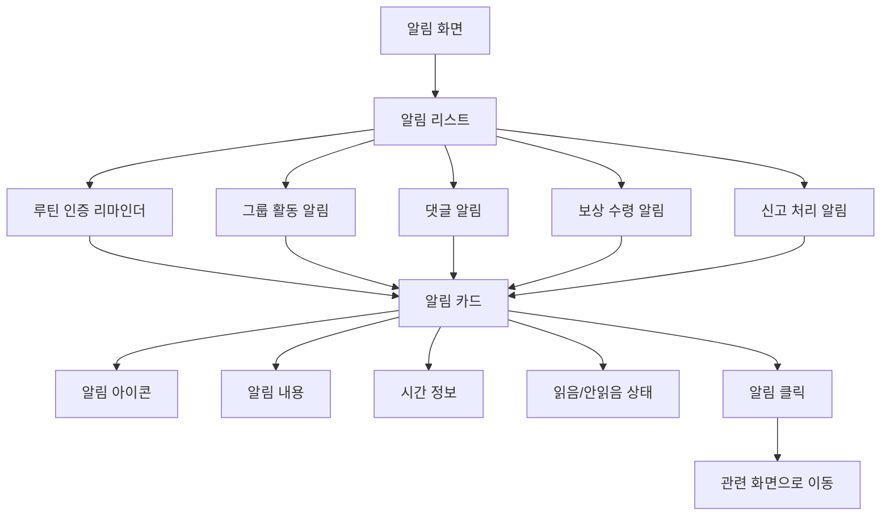

#### 화면 설명

- **알림 리스트**: 시간순으로 알림 표시
- **알림 카드**: 
  - 알림 아이콘 (종류별로 다른 아이콘)
  - 알림 내용
  - 시간 정보
  - 읽음/안읽음 상태 표시
- **알림 종류**:
  - 루틴 인증 리마인더
  - 그룹 활동 (새 멤버, 새 게시물)
  - 댓글 및 반응
  - 보상 수령
  - 신고 처리 결과
- **알림 클릭**: 관련 화면으로 이동

---

### 6.3 설정 화면

#### 텍스트 Wireframe

```
┌─────────────────────────────────┐
│  [←]            설정            │
│                                 │
│  ────────────────────────────  │
│                                 │
│  계정                            │
│  ┌─────────────────────────┐   │
│  │ 프로필 수정        [>]  │   │
│  └─────────────────────────┘   │
│  ┌─────────────────────────┐   │
│  │ 계정 관리            [>] │   │
│  └─────────────────────────┘   │
│                                 │
│  ────────────────────────────  │
│                                 │
│  알림 설정                       │
│  ┌─────────────────────────┐   │
│  │ 루틴 인증 리마인더  [ON]│   │
│  └─────────────────────────┘   │
│  ┌─────────────────────────┐   │
│  │ 그룹 활동 알림      [ON] │   │
│  └─────────────────────────┘   │
│  ┌─────────────────────────┐   │
│  │ 댓글 알림           [ON] │   │
│  └─────────────────────────┘   │
│                                 │
│  ────────────────────────────  │
│                                 │
│  기타                            │
│  ┌─────────────────────────┐   │
│  │ 고객 지원            [>] │   │
│  └─────────────────────────┘   │
│  ┌─────────────────────────┐   │
│  │ 이용약관             [>] │   │
│  └─────────────────────────┘   │
│  ┌─────────────────────────┐   │
│  │ 개인정보처리방침     [>] │   │
│  └─────────────────────────┘   │
│                                 │
│  ────────────────────────────  │
│                                 │
│  ┌─────────────────────────┐   │
│  │   [로그아웃]            │   │
│  └─────────────────────────┘   │
│                                 │
└─────────────────────────────────┘
```

#### Mermaid 다이어그램

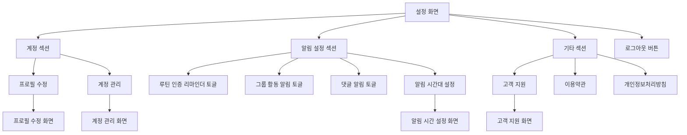

#### 화면 설명

- **계정 섹션**: 프로필 수정, 계정 관리
- **알림 설정 섹션**: 각종 알림 ON/OFF 토글
  - 루틴 인증 리마인더
  - 그룹 활동 알림
  - 댓글 알림
  - 알림 시간대 설정 (하위 메뉴)
- **기타 섹션**: 고객 지원, 이용약관, 개인정보처리방침
- **로그아웃 버튼**: 계정 로그아웃

---

## 7. 기타 기능

### 7.1 신고 화면

#### 텍스트 Wireframe

```
┌─────────────────────────────────┐
│  [←]            신고            │
│                                 │
│  ────────────────────────────  │
│                                 │
│  신고 사유를 선택해주세요        │
│                                 │
│  ┌─────────────────────────┐   │
│  │ ○ 무관한 루틴 인증      │   │
│  └─────────────────────────┘   │
│                                 │
│  ┌─────────────────────────┐   │
│  │ ○ 유해한 사진           │   │
│  └─────────────────────────┘   │
│                                 │
│  ┌─────────────────────────┐   │
│  │ ○ 스팸 또는 도배         │   │
│  └─────────────────────────┘   │
│                                 │
│  ┌─────────────────────────┐   │
│  │ ○ 기타 부적절한 행위    │   │
│  └─────────────────────────┘   │
│                                 │
│  ────────────────────────────  │
│                                 │
│  상세 내용 (선택)                │
│  ┌─────────────────────────┐   │
│  │  신고 사유를 자세히      │   │
│  │  설명해주세요            │   │
│  │                         │   │
│  │                         │   │
│  └─────────────────────────┘   │
│                                 │
│  ⚠️ 허위 신고는 제재될 수        │
│     있습니다                    │
│                                 │
│  ────────────────────────────  │
│                                 │
│  ┌─────────────────────────┐   │
│  │   [신고하기]            │   │
│  └─────────────────────────┘   │
│                                 │
└─────────────────────────────────┘
```

#### Mermaid 다이어그램

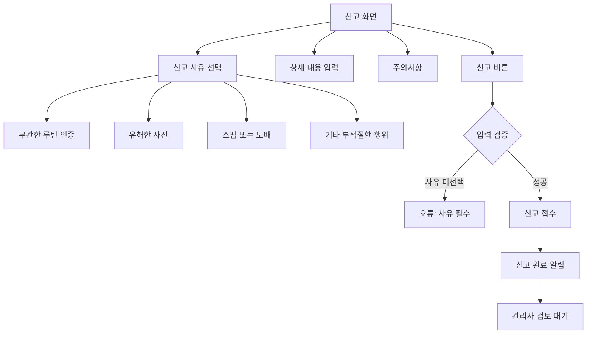

#### 화면 설명

- **신고 사유 선택**: 라디오 버튼으로 사유 선택 (필수)
  - 무관한 루틴 인증
  - 유해한 사진
  - 스팸 또는 도배
  - 기타 부적절한 행위
- **상세 내용**: 신고 사유에 대한 상세 설명 (선택)
- **주의사항**: 허위 신고에 대한 경고
- **신고 버튼**: 신고 접수 및 관리자 검토 대기

---

### 7.2 식물키우기 화면

#### 텍스트 Wireframe

```
┌─────────────────────────────────┐
│  [←]        식물키우기          │
│                                 │
│  ────────────────────────────  │
│                                 │
│         [식물 이미지]           │
│                                 │
│      🌱 새싹 단계               │
│                                 │
│  성장도: ████░░░░░░ 40%         │
│                                 │
│  ────────────────────────────  │
│                                 │
│  오늘 물주기 완료! ✅           │
│                                 │
│  ────────────────────────────  │
│                                 │
│  성장 기록                       │
│  ┌─────────────────────────┐   │
│  │ 연속 인증: 5일           │   │
│  │ 총 물주기: 12회          │   │
│  └─────────────────────────┘   │
│                                 │
│  ────────────────────────────  │
│                                 │
│  내 식물 컬렉션                  │
│  ┌──┐ ┌──┐ ┌──┐ ┌──┐          │
│  │🌱│ │🌿│ │🌳│ │🌸│          │
│  │선택│ │  │ │  │ │  │          │
│  └──┘ └──┘ └──┘ └──┘          │
│                                 │
│  ────────────────────────────  │
│                                 │
│  ┌─────────────────────────┐   │
│  │   [식물 상점]           │   │
│  └─────────────────────────┘   │
│                                 │
└─────────────────────────────────┘
```

#### Mermaid 다이어그램

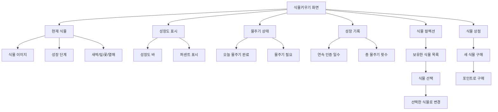

#### 화면 설명

- **현재 식물**: 선택한 식물의 현재 상태 표시
  - 식물 이미지 (성장 단계별)
  - 성장 단계 표시 (새싹, 잎, 꽃, 열매)
- **성장도**: 진행 바와 퍼센트로 표시
- **물주기 상태**: 오늘 인증 완료 여부 표시
- **성장 기록**: 연속 인증 일수, 총 물주기 횟수
- **식물 컬렉션**: 보유한 식물 목록 (그리드)
  - 식물 선택 시 현재 식물로 변경
- **식물 상점**: 포인트로 새 식물 구매

---

## 화면 간 네비게이션 플로우

### 주요 사용자 플로우

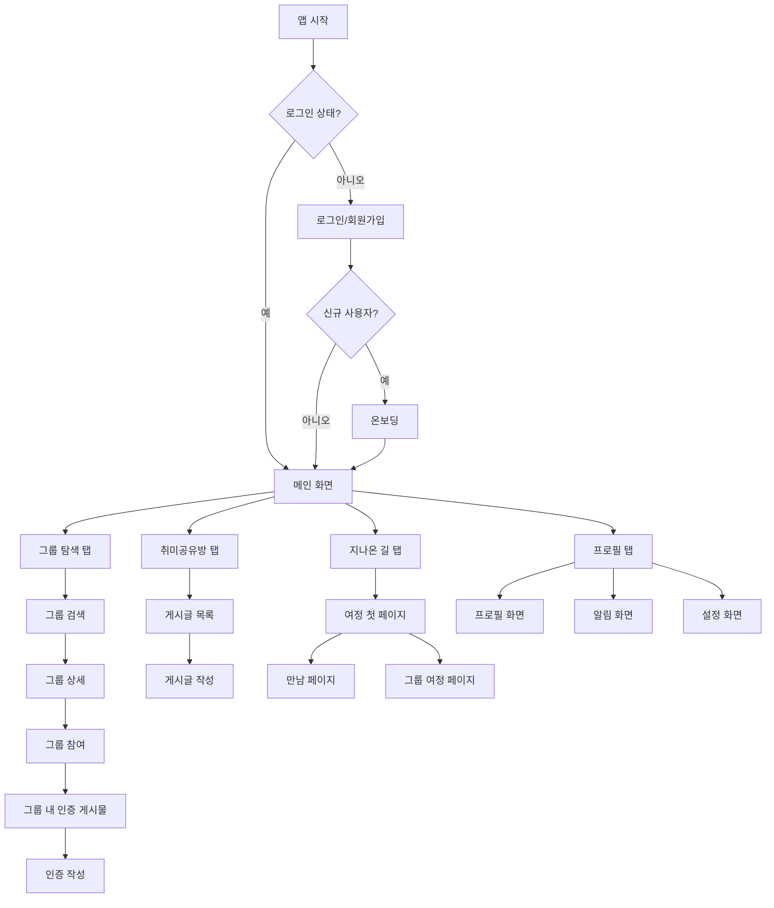

---

## 참고사항

### 디자인 가이드라인

1. **색상 구분**:
   - All Clear 그룹: 골드 테두리, 반짝임 효과
   - 일반 참여 (20% 이상): 일반 색상
   - 낮은 참여 (20% 미만): 낮은 채도 색상 (어두운 회색 톤)

2. **레이아웃**:
   - 모바일 앱 기준 (세로 방향)
   - 하단 탭 네비게이션 고정
   - 카드 기반 UI 컴포넌트

3. **인터랙션**:
   - 패들렛 형식 그리드 레이아웃 (인증 게시물)
   - 무한 스크롤 (리스트 화면)
   - 카드 클릭 시 상세 보기

4. **반응형 요소**:
   - 프로필 이미지: 원형
   - 그룹 카드: 그리드 레이아웃 (2열)
   - 인증 카드: 그리드 레이아웃 (3열)

---

본 wireframe은 기획안(`docs/기획안.md`)을 바탕으로 작성되었으며, 실제 개발 시 세부 사항은 추가로 보완될 수 있습니다.
