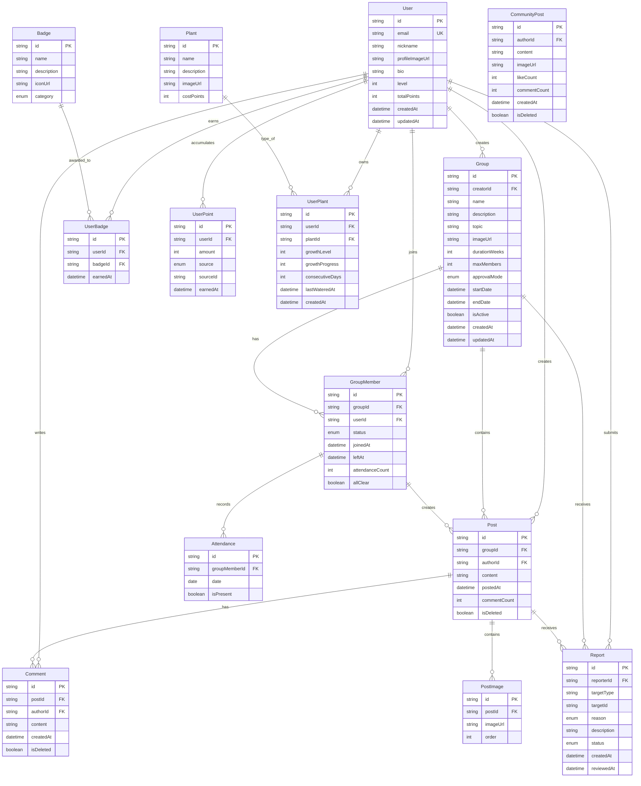

# 그룹 챌린지 어플리케이션 코드 아키텍처

본 문서는 그룹 챌린지 어플리케이션의 기술 스택, 프로젝트 구조, 아키텍처 설계를 정의합니다.

## 목차

1. [기술 스택](#1-기술-스택)
2. [프로젝트 구조](#2-프로젝트-구조)
3. [데이터베이스 설계](#3-데이터베이스-설계)
4. [API 설계](#4-api-설계)
5. [인증 및 보안](#5-인증-및-보안)
6. [파일 저장소](#6-파일-저장소)
7. [상태 관리](#7-상태-관리)
8. [스타일링](#8-스타일링)
9. [실시간 기능](#9-실시간-기능)
10. [배포 전략](#10-배포-전략)
11. [개발 환경 설정](#11-개발-환경-설정)

---

## 1. 기술 스택

### 1.1 프론트엔드

**프레임워크**
- **Next.js 15.1.6** (LTS, React 19 공식 지원)
  - App Router 사용
  - Server Components 및 Server Actions 활용
  - Turbopack 개발 서버 (성능 향상)

**UI 라이브러리**
- **React 19.2.3** (최신 안정 버전)
- **TypeScript 5.9** (타입 안정성)

**상태 관리**
- **Zustand 5.0.3** (전역 상태 관리)
  - 가벼움 (약 1.2KB gzipped)
  - 간단한 API
  - 미들웨어 지원 (persist, devtools)

**폼 관리**
- **React Hook Form 7.71.0** (폼 검증 및 관리)
- **Zod 3.24.1** (스키마 검증)

**UI 컴포넌트**
- **Tailwind CSS 3.4.17** (유틸리티 CSS 프레임워크)
- **shadcn/ui** (재사용 가능한 컴포넌트 라이브러리)
- **Radix UI** (접근성 우선 컴포넌트, shadcn/ui 기반)

**아이콘**
- **Lucide React** (아이콘 라이브러리)

**이미지 처리**
- **next/image** (Next.js 내장 이미지 최적화)
- **sharp** (서버 사이드 이미지 리사이징)

### 1.2 백엔드

**API**
- **Next.js API Routes** (서버리스 함수)
- **Server Actions** (폼 제출 및 데이터 변환)

**인증**
- **NextAuth.js v4.24.13** (안정 버전)
  - 소셜 로그인 (카카오, 구글, 네이버)
  - 이메일/비밀번호 인증
  - JWT 세션 관리

**데이터베이스**
- **Supabase** (PostgreSQL + 인증 + 스토리지)
  - PostgreSQL 15 (관계형 데이터베이스)
  - Row Level Security (RLS)
  - 실시간 구독 기능
  - 파일 스토리지 (이미지 백업용)

**ORM**
- **Prisma 6.1.0** (타입 안전한 데이터베이스 클라이언트)
  - 마이그레이션 관리
  - 타입 자동 생성

**파일 저장소**
- **Vercel Blob Storage** (이미지 업로드)
  - CDN 통합
  - 자동 최적화

### 1.3 개발 도구

**코드 품질**
- **ESLint** (린터)
- **Prettier** (코드 포맷터)
- **TypeScript** (타입 체크)

**테스팅** (향후 추가)
- **Vitest** (유닛 테스트)
- **Playwright** (E2E 테스트)

**모니터링** (향후 추가)
- **Vercel Analytics** (웹 분석)
- **Sentry** (에러 추적)

---

## 2. 프로젝트 구조

### 2.1 폴더 구조

```
프로젝트 루트/
├── app/                          # Next.js App Router
│   ├── (auth)/                   # 인증 관련 라우트 그룹
│   │   ├── login/
│   │   ├── signup/
│   │   └── layout.tsx
│   ├── (main)/                   # 메인 앱 라우트 그룹
│   │   ├── groups/               # 그룹 관련 페이지
│   │   │   ├── [id]/
│   │   │   │   ├── page.tsx      # 그룹 상세
│   │   │   │   └── posts/        # 인증 게시물
│   │   │   ├── create/
│   │   │   └── search/
│   │   ├── community/            # 취미공유방
│   │   │   ├── page.tsx
│   │   │   └── [id]/
│   │   ├── journey/              # 지나온 길
│   │   │   ├── page.tsx          # 첫 페이지
│   │   │   ├── encounters/       # 만남 페이지
│   │   │   └── groups/           # 그룹 여정
│   │   ├── profile/              # 프로필
│   │   │   ├── page.tsx
│   │   │   ├── settings/
│   │   │   └── notifications/
│   │   └── plant/                # 식물키우기
│   ├── api/                      # API Routes
│   │   ├── auth/
│   │   │   └── [...nextauth]/
│   │   ├── groups/
│   │   ├── posts/
│   │   ├── upload/
│   │   └── reports/
│   ├── layout.tsx                 # 루트 레이아웃
│   └── page.tsx                   # 홈 페이지
├── components/                   # 재사용 컴포넌트
│   ├── ui/                       # shadcn/ui 컴포넌트
│   │   ├── button.tsx
│   │   ├── card.tsx
│   │   ├── input.tsx
│   │   └── ...
│   ├── features/                 # 기능별 컴포넌트
│   │   ├── groups/
│   │   │   ├── GroupCard.tsx
│   │   │   ├── GroupDetail.tsx
│   │   │   └── GroupForm.tsx
│   │   ├── posts/
│   │   │   ├── PostGrid.tsx
│   │   │   ├── PostCard.tsx
│   │   │   └── PostForm.tsx
│   │   ├── comments/
│   │   ├── profile/
│   │   └── plant/
│   ├── layout/                   # 레이아웃 컴포넌트
│   │   ├── Header.tsx
│   │   ├── Footer.tsx
│   │   └── BottomNav.tsx
│   └── shared/                   # 공통 컴포넌트
│       ├── Avatar.tsx
│       ├── Badge.tsx
│       └── Loading.tsx
├── lib/                          # 유틸리티 및 설정
│   ├── auth.ts                   # NextAuth 설정
│   ├── db.ts                     # Prisma 클라이언트
│   ├── supabase.ts               # Supabase 클라이언트
│   ├── blob.ts                   # Vercel Blob 설정
│   ├── utils.ts                  # 유틸리티 함수
│   └── constants.ts              # 상수
├── hooks/                        # 커스텀 훅
│   ├── useAuth.ts
│   ├── useGroups.ts
│   ├── usePosts.ts
│   └── useUpload.ts
├── store/                        # Zustand 스토어
│   ├── authStore.ts
│   ├── uiStore.ts
│   └── groupStore.ts
├── types/                        # TypeScript 타입
│   ├── auth.ts
│   ├── group.ts
│   ├── post.ts
│   └── user.ts
├── schemas/                      # Zod 스키마
│   ├── group.ts
│   ├── post.ts
│   └── user.ts
├── prisma/                       # Prisma 설정
│   ├── schema.prisma
│   └── migrations/
├── public/                       # 정적 파일
│   ├── images/
│   └── icons/
├── docs/                         # 문서
│   ├── 기획안.md
│   ├── 디자인가이드.md
│   ├── wireframe.md
│   └── 코드아키텍처.md
├── .env.local                    # 환경 변수 (로컬)
├── .env.example                  # 환경 변수 예시
├── next.config.ts                # Next.js 설정
├── tailwind.config.ts            # Tailwind 설정
├── tsconfig.json                 # TypeScript 설정
├── package.json
└── README.md
```

### 2.2 주요 디렉토리 설명

**app/**
- Next.js App Router 기반 라우팅
- Server Components 기본 사용
- Client Components는 `'use client'` 지시어 사용

**components/ui/**
- shadcn/ui 기반 재사용 가능한 UI 컴포넌트
- 디자인 시스템 토큰 적용

**components/features/**
- 비즈니스 로직이 포함된 기능별 컴포넌트
- 페이지별로 그룹화

**lib/**
- 외부 서비스 클라이언트 설정
- 공통 유틸리티 함수

**store/**
- Zustand 전역 상태 관리
- 도메인별로 스토어 분리

**schemas/**
- Zod 스키마 정의
- 폼 검증 및 API 요청/응답 검증

---

## 3. 데이터베이스 설계

### 3.1 데이터베이스 선택

**Supabase PostgreSQL** 사용 이유:
- Vercel과 통합 가능 (Marketplace)
- 인증, 스토리지, 실시간 기능 포함
- Row Level Security (RLS) 지원
- 무료 티어 제공 (500MB 스토리지, 50K MAU)

### 3.2 ERD (Entity Relationship Diagram)



### 3.3 주요 테이블 스키마

#### User (사용자)
```prisma
model User {
  id            String   @id @default(cuid())
  email         String   @unique
  emailVerified DateTime?
  nickname      String
  profileImageUrl String?
  bio           String?
  level         Int      @default(1)
  totalPoints   Int      @default(0)
  createdAt     DateTime @default(now())
  updatedAt     DateTime @updatedAt

  // Relations
  createdGroups    Group[]
  groupMemberships GroupMember[]
  posts            Post[]
  comments         Comment[]
  reports          Report[]
  badges           UserBadge[]
  points           UserPoint[]
  plants           UserPlant[]
  communityPosts   CommunityPost[]

  @@map("users")
}
```

#### Group (그룹)
```prisma
model Group {
  id            String   @id @default(cuid())
  creatorId     String
  name          String
  description   String
  topic         String
  imageUrl      String?
  durationWeeks Int      // 3, 4, 8, 12 (주 단위)
  maxMembers    Int
  approvalMode  ApprovalMode @default(AUTO)
  startDate     DateTime
  endDate       DateTime
  isActive      Boolean  @default(true)
  createdAt     DateTime @default(now())
  updatedAt     DateTime @updatedAt

  // Relations
  creator       User          @relation(fields: [creatorId], references: [id])
  members       GroupMember[]
  posts         Post[]
  reports       Report[]

  @@map("groups")
}

enum ApprovalMode {
  AUTO    // 자동 승인
  MANUAL  // 수동 승인
}
```

#### GroupMember (그룹 멤버)
```prisma
model GroupMember {
  id             String   @id @default(cuid())
  groupId        String
  userId         String
  status         MemberStatus @default(ACTIVE)
  joinedAt       DateTime @default(now())
  leftAt         DateTime?
  attendanceCount Int     @default(0)
  allClear       Boolean  @default(false)
  createdAt      DateTime @default(now())
  updatedAt      DateTime @updatedAt

  // Relations
  group          Group       @relation(fields: [groupId], references: [id])
  user           User        @relation(fields: [userId], references: [id])
  posts          Post[]
  attendances    Attendance[]

  @@unique([groupId, userId])
  @@map("group_members")
}

enum MemberStatus {
  ACTIVE
  PENDING
  LEFT
  REMOVED
}
```

#### Post (인증 게시물)
```prisma
model Post {
  id           String   @id @default(cuid())
  groupId      String
  authorId     String
  content      String?
  postedAt     DateTime @default(now())
  commentCount Int      @default(0)
  isDeleted    Boolean  @default(false)
  createdAt    DateTime @default(now())
  updatedAt    DateTime @updatedAt

  // Relations
  group        Group        @relation(fields: [groupId], references: [id])
  author       User         @relation(fields: [authorId], references: [id])
  images       PostImage[]
  comments     Comment[]
  reports      Report[]

  @@index([groupId, postedAt])
  @@map("posts")
}
```

#### Attendance (출석 기록)
```prisma
model Attendance {
  id             String   @id @default(cuid())
  groupMemberId String
  date           DateTime @db.Date
  isPresent      Boolean  @default(false)
  createdAt      DateTime @default(now())

  // Relations
  groupMember    GroupMember @relation(fields: [groupMemberId], references: [id])

  @@unique([groupMemberId, date])
  @@index([groupMemberId])
  @@map("attendances")
}
```

#### Report (신고)
```prisma
model Report {
  id          String      @id @default(cuid())
  reporterId  String
  targetType  ReportTarget
  targetId    String
  reason      ReportReason
  description String?
  status      ReportStatus @default(PENDING)
  createdAt   DateTime    @default(now())
  reviewedAt  DateTime?

  // Relations
  reporter    User        @relation(fields: [reporterId], references: [id])
  group       Group?      @relation(fields: [targetId], references: [id])
  post        Post?       @relation(fields: [targetId], references: [id])

  @@index([status, createdAt])
  @@map("reports")
}

enum ReportTarget {
  GROUP
  POST
  USER
}

enum ReportReason {
  IRRELEVANT_CONTENT
  HARMFUL_IMAGE
  SPAM
  INAPPROPRIATE_BEHAVIOR
  OTHER
}

enum ReportStatus {
  PENDING
  APPROVED
  REJECTED
  RESOLVED
}
```

### 3.4 인덱스 전략

**성능 최적화를 위한 인덱스:**
- `Group`: `creatorId`, `isActive`, `startDate`, `endDate`
- `GroupMember`: `userId`, `groupId`, `status`
- `Post`: `(groupId, postedAt)`, `authorId`
- `Attendance`: `(groupMemberId, date)`
- `Report`: `(status, createdAt)`

### 3.5 Row Level Security (RLS) 정책

Supabase RLS를 사용하여 데이터 접근 제어:

**User 테이블**
- 사용자는 자신의 정보만 조회/수정 가능
- 공개 정보(닉네임, 프로필 이미지)는 모든 사용자 조회 가능

**Group 테이블**
- 활성 그룹은 모든 사용자 조회 가능
- 그룹장만 수정 가능

**Post 테이블**
- 그룹 멤버만 조회 가능
- 작성자만 수정/삭제 가능

**GroupMember 테이블**
- 그룹 멤버만 해당 그룹의 멤버 목록 조회 가능

---

## 4. API 설계

### 4.1 API 구조

**Next.js App Router 기반:**
- Server Actions: 폼 제출, 데이터 변환
- API Routes: 외부 연동, 웹훅

### 4.2 주요 API 엔드포인트

#### 인증 (NextAuth.js)
```
POST /api/auth/signin
POST /api/auth/signout
GET  /api/auth/session
POST /api/auth/callback/[provider]
```

#### 그룹
```
GET    /api/groups              # 그룹 목록 조회 (검색, 필터)
GET    /api/groups/[id]         # 그룹 상세 조회
POST   /api/groups              # 그룹 생성
PATCH  /api/groups/[id]         # 그룹 수정 (그룹장만)
DELETE /api/groups/[id]        # 그룹 삭제 (그룹장만, 시작 전)
POST   /api/groups/[id]/join    # 그룹 참여 신청
POST   /api/groups/[id]/leave   # 그룹 탈퇴
GET    /api/groups/[id]/members # 멤버 목록
```

#### 게시물 (인증)
```
GET    /api/groups/[id]/posts   # 그룹 내 게시물 목록
GET    /api/posts/[id]           # 게시물 상세
POST   /api/posts                # 게시물 작성
DELETE /api/posts/[id]           # 게시물 삭제
```

#### 댓글
```
GET    /api/posts/[id]/comments # 댓글 목록
POST   /api/comments             # 댓글 작성
DELETE /api/comments/[id]       # 댓글 삭제
```

#### 신고
```
POST   /api/reports              # 신고 접수
GET    /api/reports              # 신고 목록 (관리자)
PATCH  /api/reports/[id]         # 신고 처리 (관리자)
```

#### 파일 업로드
```
POST   /api/upload               # 이미지 업로드 (Vercel Blob)
```

#### 사용자
```
GET    /api/users/[id]           # 사용자 프로필 조회
PATCH  /api/users/[id]           # 프로필 수정
GET    /api/users/[id]/badges    # 배지 목록
GET    /api/users/[id]/points    # 포인트 내역
```

#### 취미공유방
```
GET    /api/community/posts      # 게시글 목록
POST   /api/community/posts      # 게시글 작성
GET    /api/community/posts/[id] # 게시글 상세
DELETE /api/community/posts/[id] # 게시글 삭제
```

### 4.3 Server Actions 예시

```typescript
// app/actions/group.ts
'use server'

import { revalidatePath } from 'next/cache'
import { z } from 'zod'
import { createGroupSchema } from '@/schemas/group'
import { db } from '@/lib/db'
import { getServerSession } from 'next-auth'

export async function createGroup(data: z.infer<typeof createGroupSchema>) {
  const session = await getServerSession()
  if (!session?.user) {
    throw new Error('Unauthorized')
  }

  const group = await db.group.create({
    data: {
      ...data,
      creatorId: session.user.id,
      startDate: new Date(),
      endDate: calculateEndDate(data.durationWeeks),
    },
  })

  revalidatePath('/groups')
  return group
}

export async function joinGroup(groupId: string) {
  const session = await getServerSession()
  if (!session?.user) {
    throw new Error('Unauthorized')
  }

  // 그룹 정보 확인
  const group = await db.group.findUnique({
    where: { id: groupId },
    include: { members: true },
  })

  if (!group) {
    throw new Error('Group not found')
  }

  if (group.members.length >= group.maxMembers) {
    throw new Error('Group is full')
  }

  // 참여 처리
  if (group.approvalMode === 'AUTO') {
    await db.groupMember.create({
      data: {
        groupId,
        userId: session.user.id,
        status: 'ACTIVE',
      },
    })
  } else {
    await db.groupMember.create({
      data: {
        groupId,
        userId: session.user.id,
        status: 'PENDING',
      },
    })
  }

  revalidatePath(`/groups/${groupId}`)
}
```

### 4.4 API 응답 형식

**성공 응답**
```typescript
{
  success: true,
  data: T,
  message?: string
}
```

**에러 응답**
```typescript
{
  success: false,
  error: {
    code: string,
    message: string,
    details?: unknown
  }
}
```

---

## 5. 인증 및 보안

### 5.1 인증 방식

**NextAuth.js v4 사용:**
- 소셜 로그인: 카카오, 구글, 네이버
- 이메일/비밀번호: Credentials Provider
- JWT 세션 관리

### 5.2 NextAuth 설정

```typescript
// lib/auth.ts
import { NextAuthOptions } from 'next-auth'
import KakaoProvider from 'next-auth/providers/kakao'
import GoogleProvider from 'next-auth/providers/google'
import NaverProvider from 'next-auth/providers/naver'
import CredentialsProvider from 'next-auth/providers/credentials'
import { PrismaAdapter } from '@next-auth/prisma-adapter'
import { db } from '@/lib/db'
import bcrypt from 'bcryptjs'

export const authOptions: NextAuthOptions = {
  adapter: PrismaAdapter(db),
  providers: [
    KakaoProvider({
      clientId: process.env.KAKAO_CLIENT_ID!,
      clientSecret: process.env.KAKAO_CLIENT_SECRET!,
    }),
    GoogleProvider({
      clientId: process.env.GOOGLE_CLIENT_ID!,
      clientSecret: process.env.GOOGLE_CLIENT_SECRET!,
    }),
    NaverProvider({
      clientId: process.env.NAVER_CLIENT_ID!,
      clientSecret: process.env.NAVER_CLIENT_SECRET!,
    }),
    CredentialsProvider({
      name: 'Credentials',
      credentials: {
        email: { label: 'Email', type: 'email' },
        password: { label: 'Password', type: 'password' },
      },
      async authorize(credentials) {
        if (!credentials?.email || !credentials?.password) {
          return null
        }

        const user = await db.user.findUnique({
          where: { email: credentials.email },
        })

        if (!user || !user.password) {
          return null
        }

        const isValid = await bcrypt.compare(
          credentials.password,
          user.password
        )

        if (!isValid) {
          return null
        }

        return {
          id: user.id,
          email: user.email,
          name: user.nickname,
        }
      },
    }),
  ],
  session: {
    strategy: 'jwt',
    maxAge: 30 * 24 * 60 * 60, // 30일
  },
  pages: {
    signIn: '/login',
    signOut: '/',
  },
  callbacks: {
    async jwt({ token, user }) {
      if (user) {
        token.id = user.id
      }
      return token
    },
    async session({ session, token }) {
      if (session.user) {
        session.user.id = token.id as string
      }
      return session
    },
  },
}
```

### 5.3 보안 조치

**비밀번호 해싱**
- bcryptjs 사용 (라운드: 12)

**CSRF 보호**
- NextAuth.js 내장 CSRF 토큰

**XSS 방지**
- React의 자동 이스케이프
- DOMPurify (필요 시)

**SQL Injection 방지**
- Prisma ORM 사용 (파라미터화된 쿼리)

**Rate Limiting**
- Vercel Edge Config 또는 Upstash Redis (향후 추가)

**이미지 업로드 검증**
- 파일 타입 검증 (MIME type)
- 파일 크기 제한 (10MB)
- 이미지 리사이징

---

## 6. 파일 저장소

### 6.1 이미지 업로드 전략

**Vercel Blob Storage 사용:**
- CDN 통합
- 자동 최적화
- 글로벌 엣지 배포

### 6.2 업로드 플로우

```typescript
// lib/upload.ts
import { put } from '@vercel/blob'
import sharp from 'sharp'

export async function uploadImage(
  file: File,
  folder: string = 'uploads'
): Promise<string> {
  // 이미지 리사이징 (최대 1920px)
  const buffer = await file.arrayBuffer()
  const resized = await sharp(Buffer.from(buffer))
    .resize(1920, 1920, {
      fit: 'inside',
      withoutEnlargement: true,
    })
    .webp({ quality: 85 })
    .toBuffer()

  // Vercel Blob에 업로드
  const blob = await put(`${folder}/${Date.now()}-${file.name}`, resized, {
    access: 'public',
    addRandomSuffix: true,
    contentType: 'image/webp',
  })

  return blob.url
}
```

### 6.3 클라이언트 업로드 (대용량 파일)

```typescript
// app/api/upload/route.ts
import { handleUpload } from '@vercel/blob/client'
import { NextResponse } from 'next/server'

export async function POST(request: Request) {
  const body = await request.json()

  return handleUpload({
    body,
    request,
    onBeforeGenerateToken: async (pathname) => {
      return {
        allowedContentTypes: ['image/jpeg', 'image/png', 'image/webp'],
        addRandomSuffix: true,
      }
    },
    onUploadCompleted: async ({ blob }) => {
      // 업로드 완료 후 처리 (예: DB에 URL 저장)
      console.log('Upload completed:', blob.url)
    },
  })
}
```

---

## 7. 상태 관리

### 7.1 Zustand 스토어 구조

**인증 스토어**
```typescript
// store/authStore.ts
import { create } from 'zustand'
import { persist } from 'zustand/middleware'
import { useSession } from 'next-auth/react'

interface AuthState {
  user: User | null
  isLoading: boolean
  setUser: (user: User | null) => void
  logout: () => void
}

export const useAuthStore = create<AuthState>()(
  persist(
    (set) => ({
      user: null,
      isLoading: true,
      setUser: (user) => set({ user, isLoading: false }),
      logout: () => set({ user: null }),
    }),
    {
      name: 'auth-storage',
    }
  )
)
```

**UI 스토어**
```typescript
// store/uiStore.ts
import { create } from 'zustand'

interface UIState {
  sidebarOpen: boolean
  theme: 'light' | 'dark'
  toggleSidebar: () => void
  setTheme: (theme: 'light' | 'dark') => void
}

export const useUIStore = create<UIState>((set) => ({
  sidebarOpen: false,
  theme: 'light',
  toggleSidebar: () => set((state) => ({ sidebarOpen: !state.sidebarOpen })),
  setTheme: (theme) => set({ theme }),
}))
```

### 7.2 서버 상태 관리

**React Query (TanStack Query) 고려사항:**
- 향후 추가 검토 (캐싱, 동기화 필요 시)

**현재는 Server Components 활용:**
- 서버에서 데이터 페칭
- 클라이언트는 필요한 경우만 상태 관리

---

## 8. 스타일링

### 8.1 Tailwind CSS 설정

**디자인 토큰 적용:**
```typescript
// tailwind.config.ts
import type { Config } from 'tailwindcss'

const config: Config = {
  theme: {
    extend: {
      colors: {
        primary: {
          DEFAULT: '#6B8FA8',
          light: '#8BA8B8',
          dark: '#5A7A8F',
        },
        success: '#7FA88B',
        warning: '#C8A88F',
        error: '#B88F8F',
        // ... 디자인 가이드의 색상 팔레트
      },
      spacing: {
        // 4px 단위 간격 시스템
      },
      borderRadius: {
        // 8px, 12px, 16px, 24px
      },
    },
  },
}
```

### 8.2 shadcn/ui 컴포넌트

**설치 및 설정:**
```bash
npx shadcn-ui@latest init
npx shadcn-ui@latest add button card input
```

**커스터마이징:**
- 디자인 가이드의 색상, 간격, 타이포그래피 적용
- 컴포넌트 variants 확장

---

## 9. 실시간 기능

### 9.1 Supabase Realtime

**게시물 댓글 실시간 업데이트:**
```typescript
// hooks/useRealtimeComments.ts
import { useEffect } from 'react'
import { supabase } from '@/lib/supabase'

export function useRealtimeComments(postId: string) {
  useEffect(() => {
    const channel = supabase
      .channel(`post:${postId}`)
      .on(
        'postgres_changes',
        {
          event: 'INSERT',
          schema: 'public',
          table: 'comments',
          filter: `post_id=eq.${postId}`,
        },
        (payload) => {
          // 새 댓글 추가 처리
        }
      )
      .subscribe()

    return () => {
      supabase.removeChannel(channel)
    }
  }, [postId])
}
```

### 9.2 알림 실시간 업데이트

**WebSocket 또는 Server-Sent Events (SSE) 고려:**
- Supabase Realtime 활용
- 또는 Vercel의 Server-Sent Events

---

## 10. 배포 전략

### 10.1 Vercel 배포

**배포 플랫폼: Vercel**
- Next.js 최적화
- 자동 CI/CD (Git 연동)
- 서버리스 함수 자동 스케일링
- 글로벌 CDN

### 10.2 환경 변수

**.env.production:**
```
# Database
DATABASE_URL=
DIRECT_URL=

# NextAuth
NEXTAUTH_URL=
NEXTAUTH_SECRET=

# OAuth
KAKAO_CLIENT_ID=
KAKAO_CLIENT_SECRET=
GOOGLE_CLIENT_ID=
GOOGLE_CLIENT_SECRET=
NAVER_CLIENT_ID=
NAVER_CLIENT_SECRET=

# Vercel Blob
BLOB_READ_WRITE_TOKEN=

# Supabase
NEXT_PUBLIC_SUPABASE_URL=
NEXT_PUBLIC_SUPABASE_ANON_KEY=
SUPABASE_SERVICE_ROLE_KEY=
```

### 10.3 데이터베이스 마이그레이션

**Prisma Migrate:**
```bash
# 프로덕션 마이그레이션
npx prisma migrate deploy
```

**Vercel Build Command:**
```json
{
  "buildCommand": "prisma generate && prisma migrate deploy && next build"
}
```

### 10.4 모니터링 및 로깅

**Vercel Analytics:**
- 웹 바이탈 측정
- 사용자 행동 분석

**에러 추적 (향후):**
- Sentry 통합

---

## 11. 개발 환경 설정

### 11.1 필수 도구

- **Node.js**: 20.x LTS
- **pnpm**: 9.x (패키지 매니저)
- **Git**: 버전 관리

### 11.2 프로젝트 초기 설정

```bash
# 프로젝트 생성
npx create-next-app@latest . --typescript --tailwind --app

# 의존성 설치
pnpm install

# Prisma 초기화
npx prisma init

# 환경 변수 설정
cp .env.example .env.local

# 데이터베이스 마이그레이션
npx prisma migrate dev

# 개발 서버 실행
pnpm dev
```

### 11.3 개발 워크플로우

**브랜치 전략:**
- `main`: 프로덕션
- `develop`: 개발
- `feature/*`: 기능 개발
- `fix/*`: 버그 수정

**커밋 컨벤션:**
```
feat: 새로운 기능 추가
fix: 버그 수정
docs: 문서 수정
style: 코드 포맷팅
refactor: 코드 리팩토링
test: 테스트 추가
chore: 빌드 설정 변경
```

### 11.4 코드 품질

**ESLint 설정:**
```json
{
  "extends": [
    "next/core-web-vitals",
    "plugin:@typescript-eslint/recommended"
  ]
}
```

**Prettier 설정:**
```json
{
  "semi": false,
  "singleQuote": true,
  "tabWidth": 2,
  "trailingComma": "es5"
}
```

---

## 12. 성능 최적화

### 12.1 이미지 최적화

- `next/image` 사용
- WebP 포맷 변환
- 적절한 크기 리사이징
- Lazy loading

### 12.2 코드 스플리팅

- 동적 import 사용
- Route-based code splitting (자동)
- Component-level code splitting

### 12.3 캐싱 전략

**Next.js 캐싱:**
- Static Generation (ISR)
- Data Cache (fetch)
- Full Route Cache

**클라이언트 캐싱:**
- React Query (향후 추가 고려)

### 12.4 번들 최적화

- Tree shaking
- Dynamic imports
- Vercel의 자동 최적화

---

## 13. 보안 체크리스트

- [ ] 환경 변수 보안 (Vercel 환경 변수 사용)
- [ ] SQL Injection 방지 (Prisma 사용)
- [ ] XSS 방지 (React 자동 이스케이프)
- [ ] CSRF 보호 (NextAuth.js)
- [ ] Rate Limiting (향후 추가)
- [ ] 파일 업로드 검증 (타입, 크기)
- [ ] 인증 토큰 보안 (JWT, HttpOnly 쿠키)
- [ ] HTTPS 강제 (Vercel 자동)

---

## 14. 향후 확장 계획

### 14.1 단기 (3-6개월)

- [ ] 모바일 앱 (React Native 또는 PWA)
- [ ] 푸시 알림
- [ ] 실시간 채팅 (그룹 내)
- [ ] 통계 대시보드

### 14.2 중기 (6-12개월)

- [ ] AI 기반 추천 시스템
- [ ] 소셜 기능 강화 (친구, 팔로우)
- [ ] 결제 시스템 (프리미엄 기능)
- [ ] 다국어 지원

### 14.3 장기 (12개월+)

- [ ] 마이크로서비스 아키텍처 전환 검토
- [ ] GraphQL API 추가
- [ ] 모바일 네이티브 앱

---

## 15. 참고 자료

### 15.1 공식 문서

- [Next.js Documentation](https://nextjs.org/docs)
- [NextAuth.js Documentation](https://next-auth.js.org/)
- [Prisma Documentation](https://www.prisma.io/docs)
- [Supabase Documentation](https://supabase.com/docs)
- [Vercel Documentation](https://vercel.com/docs)
- [Tailwind CSS Documentation](https://tailwindcss.com/docs)
- [shadcn/ui Documentation](https://ui.shadcn.com/)

### 15.2 디자인 리소스

- [디자인 가이드](./디자인가이드.md)
- [Wireframe](./wireframe.md)
- [기획안](./기획안.md)

---

본 아키텍처 문서는 프로젝트의 기술적 기반을 정의하며, 개발 과정에서 지속적으로 업데이트됩니다.
